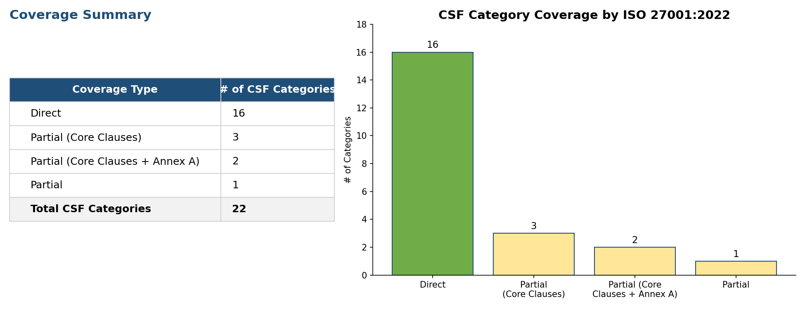
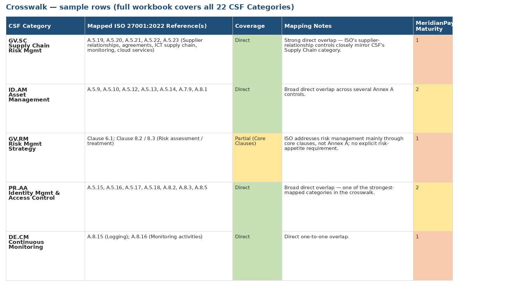

# Project 02 — NIST CSF 2.0 ↔ ISO/IEC 27001:2022 Crosswalk

**Company:** MeridianPay Financial Services (fictional) — see [`../company-profile.md`](../company-profile.md)
**Deliverable:** [`MeridianPay_NIST_CSF_ISO27001_Crosswalk.xlsx`](./MeridianPay_NIST_CSF_ISO27001_Crosswalk.xlsx)

## Objective

I mapped all 22 NIST CSF 2.0 Categories to their corresponding ISO/IEC 27001:2022 Annex A controls (and, where relevant, core management-system clauses), so MeridianPay can reuse its CSF 2.0 gap assessment (Project 01) as an early input toward a future ISO 27001 Statement of Applicability — without assessing the same controls twice.

## Methodology

1. Took each of the 22 CSF 2.0 Categories from Project 01.
2. Identified the ISO/IEC 27001:2022 Annex A control(s), or core management-system clause(s), that address the same intended outcome.
3. Classified the coverage as:
   - **Direct** — one or more Annex A controls address essentially the same outcome
   - **Partial (Core Clauses)** — covered mainly by ISO's Clauses 4–10 rather than Annex A
   - **Partial** — coverage exists only loosely, by inference from adjacent controls
4. Carried over MeridianPay's Project 01 maturity score for each category, so the reader can see gap severity and framework overlap side by side.

## Results

### Sample of the detailed crosswalk

*Full detail for all 22 CSF Categories is in [`MeridianPay_NIST_CSF_ISO27001_Crosswalk.xlsx`](./MeridianPay_NIST_CSF_ISO27001_Crosswalk.xlsx).*

## Key findings

- **16 of 22 CSF Categories (73%) map directly** to one or more ISO 27001:2022 Annex A controls — the two frameworks are highly complementary at the control level.
- The remaining 6 map only through ISO's **core management-system clauses** (Context, Risk Assessment, Management Review, Improvement) rather than Annex A — a reminder that CSF's Govern function covers ground ISO treats as foundational process, not a checklist control.
- The categories with the **lowest MeridianPay maturity** (GV.OV, ID.IM, PR.AT, DE.AE, RS.AN — all scored 0) are concentrated exactly where ISO coverage is weakest or clause-based only — meaning a future ISO 27001 readiness effort would face the same gaps this CSF assessment already surfaced.

## How to use this workbook

- **Crosswalk** tab — full category-by-category mapping, coverage type, and mapping rationale
- **Summary** tab — coverage-type roll-up with a chart
- **Instructions** tab — legend and source notes

## Note on scope

This crosswalk operates at the CSF **Category** level (22 rows), not the Subcategory level (106 rows), which is the standard level of granularity for framework crosswalks and keeps the mapping legible. ISO control titles are referenced by number for identification only; the ISO/IEC 27001:2022 standard itself is copyrighted by ISO/IEC and is not reproduced here.
