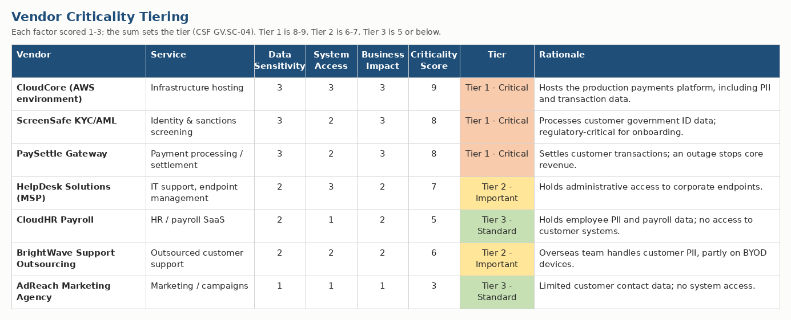
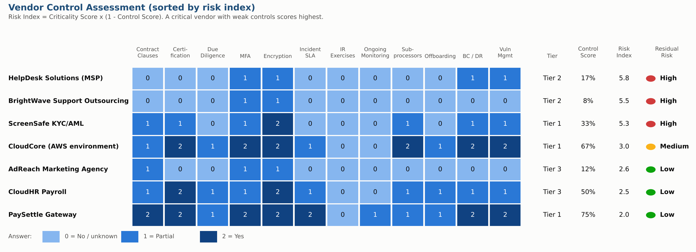
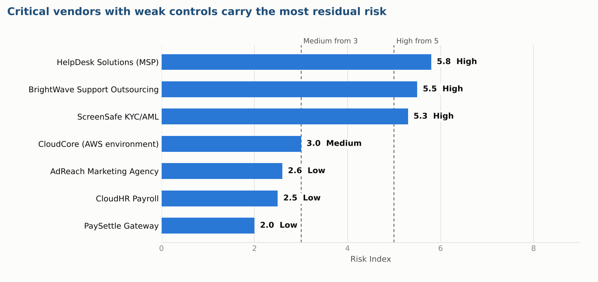
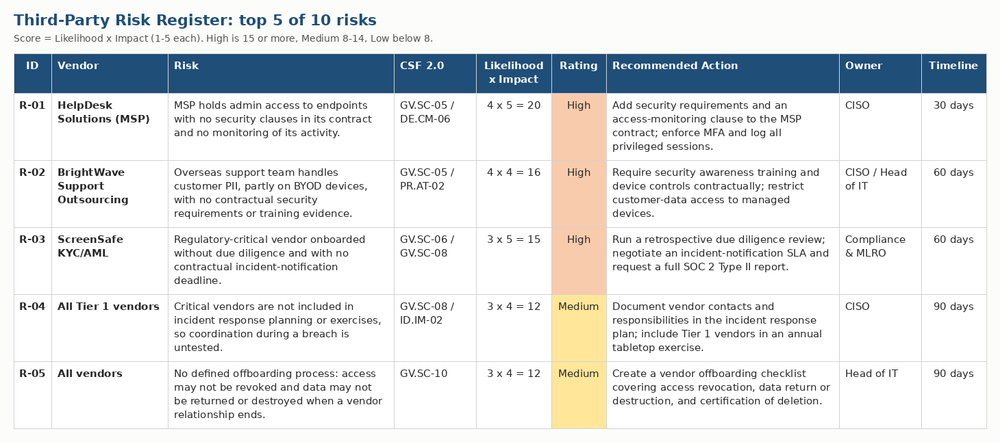

# Project 03 — Vendor / Third-Party Risk Assessment

**Company:** MeridianPay Financial Services (fictional) — see [`../company-profile.md`](../company-profile.md)
**Deliverable:** [`MeridianPay_Vendor_Risk_Assessment.xlsx`](./MeridianPay_Vendor_Risk_Assessment.xlsx)

## Objective

Apply the NIST CSF 2.0 **Cybersecurity Supply Chain Risk Management (GV.SC)** category to MeridianPay's seven key vendors: tier each one by criticality, assess its security controls, and record the resulting risks with owners and timelines. This is the follow-through on the supply chain gaps found in [Project 01](../01-gap-assessment), and it supports the US banking partner's third-party due diligence review.

All vendor names and assessment answers are fictional, invented for this portfolio.

## Methodology

1. **Tier the vendors (GV.SC-04).** Each vendor is scored 1–3 on data sensitivity, system access and business impact. The sum sets the tier: Tier 1 (8–9), Tier 2 (6–7), Tier 3 (5 or below).
2. **Assess controls (GV.SC-05 to GV.SC-10).** A 12-question questionnaire, each question mapped to a CSF 2.0 subcategory, is scored per vendor: 0 = No / unknown, 1 = Partial, 2 = Yes. Control score = points earned out of 24.
3. **Calculate residual risk.** Risk Index = Criticality Score × (1 − Control Score), so a critical vendor with weak controls scores highest. Index of 5 or more is High, 3–4.9 Medium, below 3 Low.
4. **Build the risk register.** Each risk is scored Likelihood × Impact (1–5 each), then given a treatment, an owner and a target timeline.

## Results

### Vendor tiering

### Control assessment

### Risk register (top 5 of 10)

*The full register, the questionnaire and the live formulas are in [`MeridianPay_Vendor_Risk_Assessment.xlsx`](./MeridianPay_Vendor_Risk_Assessment.xlsx).*

## Key findings

- **3 Tier 1 vendors, 2 Tier 2 and 2 Tier 3.** CloudCore (AWS), ScreenSafe KYC/AML and PaySettle Gateway are the critical vendors.
- **3 vendors carry High residual risk:** HelpDesk Solutions (MSP), BrightWave Support Outsourcing and ScreenSafe KYC/AML. One is Medium (CloudCore) and three are Low.
- **The weakest controls are in Tier 2, not Tier 1.** Tier 2 vendors average only about 13% on the questionnaire, yet the MSP holds administrative access to endpoints and BrightWave handles customer PII.
- **No vendor is part of incident response planning or exercises**, and only one has any ongoing security monitoring. These are program-level gaps, not single-vendor problems.
- **The register holds 10 risks:** 3 High, 5 Medium and 2 Low.

## Top 5 recommendations

1. Add security requirements and privileged-access monitoring to the MSP contract (30 days).
2. Require security awareness training and managed-device controls from BrightWave (60 days).
3. Run a retrospective due diligence review of ScreenSafe and negotiate an incident-notification SLA (60 days).
4. Include Tier 1 vendors in incident response planning and an annual tabletop exercise (90 days).
5. Create a vendor offboarding checklist covering access revocation and data return or destruction (90 days).

## How to use this workbook

- **Vendor Tiering** — change the blue 1–3 scores and the tier updates
- **Questionnaire** — the 12 questions and their CSF 2.0 mappings
- **Vendor Assessment** — change a blue 0/1/2 answer and the control score, risk index and rating update
- **Risk Register** — all 10 risks with treatment, owner and timeline
- **Summary** — roll-ups by tier and rating, with a chart

## Note on scope

Control mappings reference NIST CSF 2.0 and its Implementation Examples (NIST, Feb 2024). Vendors are scored on the questionnaire at the control level for a rapid assessment; a real programme would add evidence review for each Tier 1 vendor.
